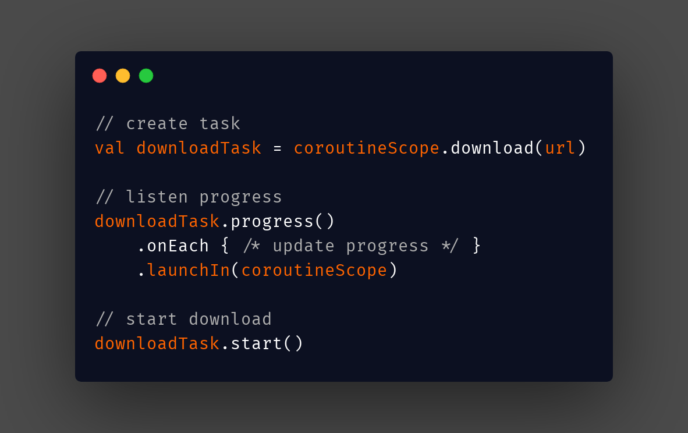

# DownloadX

[](https://jitpack.io/#ssseasonnn/DownloadX)

A multi-threaded download tool written with Coroutine and Kotlin

*Read this in other languages: [中文](README.ch.md), [English](README.md), [Changelog](CHANGELOG.md)* 

## Prepare

- Add jitpack repo:

```gradle
maven { url 'https://jitpack.io' }
```
    
- Add dependency:

```gradle
implementation "com.github.ssseasonnn:DownloadX:1.0.0"
```

## Basic Usage

```kotlin
// create download task
val downloadTask = coroutineScope.download("url")

// listen download progress
downloadTask.progress()
    .onEach { binding.button.setProgress(it)  }
    .launchIn(lifecycleScope)

// or listen download state
downloadTask.state()
    .onEach { binding.button.setState(it)  }
    .launchIn(lifecycleScope)

// start download
downloadTask.start()
```

## Create task

- Specify CoroutineScope

If the download task is limited to the lifecycle of the Activity or Fragment, you can directly use the **lifecycleScope** of the Activity or Fragment to ensure that the download task ends automatically when the Activity or Fragment is destroyed

> lifecycleScope is an extension in androidX, you need to add the following dependencies:
> implementation 'androidx.lifecycle:lifecycle-runtime-ktx:2.2.0'

```kotlin
class DemoActivity : AppCompatActivity() {
    override fun onCreate(savedInstanceState: Bundle?) {
        super.onCreate(savedInstanceState)
        
        //When the activity is destroyed, the download task automatically stops
        val downloadTask = lifecycleScope.download("url")
        downloadTask.start()
    }
}
```

If the download task needs to be shared between multiple activities, or download in the background, then directly use **GlobalScope**

```kotlin
class DemoActivity : AppCompatActivity() {
    override fun onCreate(savedInstanceState: Bundle?) {
        super.onCreate(savedInstanceState)
        
        //When the activity is destroyed, the download task still continues to download
        val downloadTask = GlobalScope.download("url")
        downloadTask.start()
    }
}
```

- Set the file name and save path

Pass directly to the download method:

```kotlin
val downloadTask = GlobalScope.download("url", "saveName", "savePath")
```

Custom DownloadParam:

```kotlin
val downloadParam = DownloadParam("url", "saveName", "savePath")
val downloadTask = lifecycleScope.download(downloadParam)
```

By default, we use **url** as the only indicator of **DownloadTask**. When you need to change this default behavior, you can customize your own **DownloadParam**:

```kotlin
class CustomDownloadParam(url: String, saveName: String, savePath: String) : DownloadParam(url, saveName, savePath) {
    override fun tag(): String {
        // Use the file path as a unique identifier
        return savePath + saveName
    }
}

val customDownloadParam = CustomDownloadParam("url", "saveName", "savePath")
val downloadTask = lifecycleScope.download(customDownloadParam)
```

When multiple pages use the same identifier (for example, the same url) to create a download task, the same DownloadTask will be returned, for example:

```kotlin
// same url
val url = "xxxx"

class DemoActivity : AppCompatActivity() {
    override fun onCreate(savedInstanceState: Bundle?) {
        super.onCreate(savedInstanceState)

        //Create download task
        val downloadTask = GlobalScope.download(url)

        downloadTask.progress()
            .onEach { progress ->  /* update progress */ }
            .launchIn(lifecycleScope)

        downloadTask.start()
    }
}

class OtherActivity : AppCompatActivity() {
    override fun onCreate(savedInstanceState: Bundle?) {
        super.onCreate(savedInstanceState)

        //Create a download task with the same url to get the download task created on the previous page
        val downloadTask = GlobalScope.download(url)

        downloadTask.progress()
            .onEach { progress ->  /* update progress */ }
            .launchIn(lifecycleScope)

        downloadTask.start()
    }
}
```

Based on this, the same download progress and download status can be shared on any number of pages

## Progress and State

- Listen progress only

This method can be used in certain scenarios when only the download progress is needed

```kotlin
val downloadTask = lifecycleScope.download("url")

downloadTask.progress()
    .onEach { progress ->  /* update progress */ }
    .launchIn(lifecycleScope) // using lifecycleScope

downloadTask.start()
```

> Use **lifecycleScope** to ensure that the monitoring is automatically released when the Activity or Fragment is destroyed


You can set the update interval for the progress() method. The default is to update every 200ms, such as:

```kotlin
downloadTask.progress(500) // Set to update the progress every 500ms
    .onEach { progress ->  
        // update progress
        setProgress(progress)
    }
    .launchIn(lifecycleScope)
```

- Listen progress and state

When you need download status and download progress, use this method to get

```kotlin
val downloadTask = lifecycleScope.download("url")

downloadTask.state()
    .onEach { state ->  
        // update state
        setState(state)
        // update progress
        setProgress(state.progress)
    }
    .launchIn(lifecycleScope)

downloadTask.start()
```

> state has the following values：**None,Waiting,Downloading,Stopped,Failed,Succeed**

Similarly, you can set the progress update interval for the state() method


## Start and Stop

- Start download

```kotlin
downloadTask.start()
```

- Stop download

```kotlin
downloadTask.stop()
```


## License

> ```
> Copyright 2021 Season.Zlc
>
> Licensed under the Apache License, Version 2.0 (the "License");
> you may not use this file except in compliance with the License.
> You may obtain a copy of the License at
>
>    http://www.apache.org/licenses/LICENSE-2.0
>
> Unless required by applicable law or agreed to in writing, software
> distributed under the License is distributed on an "AS IS" BASIS,
> WITHOUT WARRANTIES OR CONDITIONS OF ANY KIND, either express or implied.
> See the License for the specific language governing permissions and
> limitations under the License.
> ```
